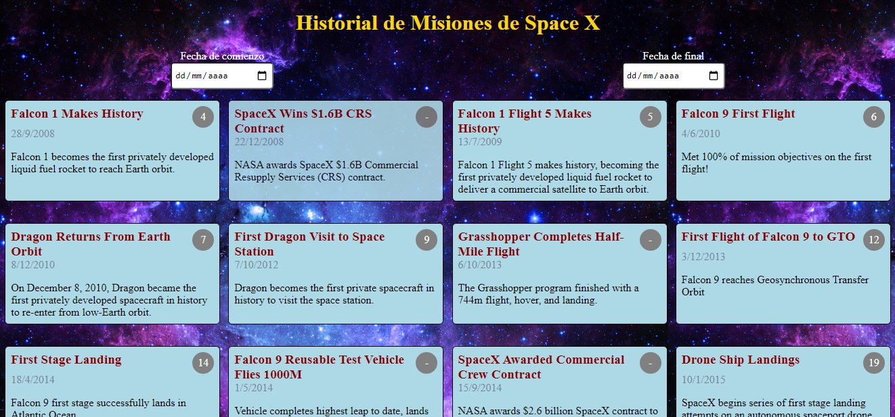

<h3>Buscador de misiones  </h3>
Dos componentes:

<ul>
  <li>DateInput</li>
  <li>MissionCard</li>
  </ul>
La estructura de la Api(que sugería el sitio)  la modifiqué utilizando el bloque try y catch en lugar de then   y la petición, la hice a travez de <strong>Fetch</strong>.Para que se ejecute los datos apenas carga la aplicación usé  <strong>useEffect</strong> y tambien para que obtenga los datos cada vez que cambia las fechas.

```
var requestOptions = {
    method: "GET",
    redirect: "follow"
  };
  let baseUrl = "https://api.spacexdata.com/v3/history";
  export const fetchHystory = async (filters) => {
    let url = baseUrl;
    if (filters.start && filters.end) {
      url += `?start=${filters.start}&end=${filters.end}`; }
    try {
      const response = await fetch(url, requestOptions);
      const data = await response.json();
      return data;
    } catch (error) {
      console.error(error);  }};
```




<p>Para mostrar los datos recibidos de la Api usé <strong>useState</strong> y el método<strong> map</strong> y luego retorna los parámetros, el número(indice) y el titulo de la misión .Para que cambien los datos mostrados deacuerdo a la fecha elegida usé el evento <strong>onChange</strong>.
</p>


App 🚀[]https://youthful-meitner-99ae35.netlify.app/


